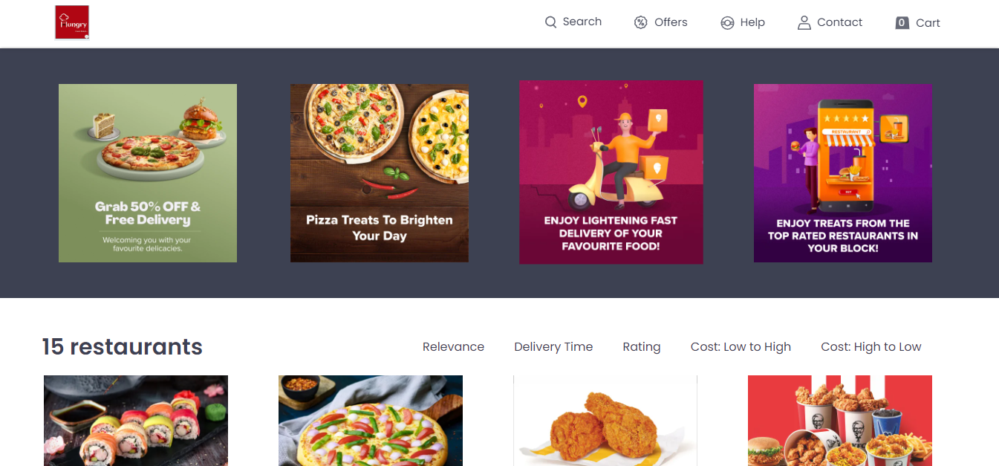
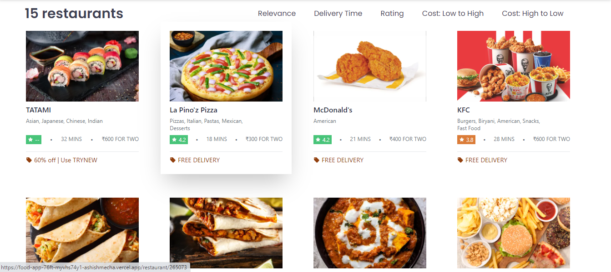
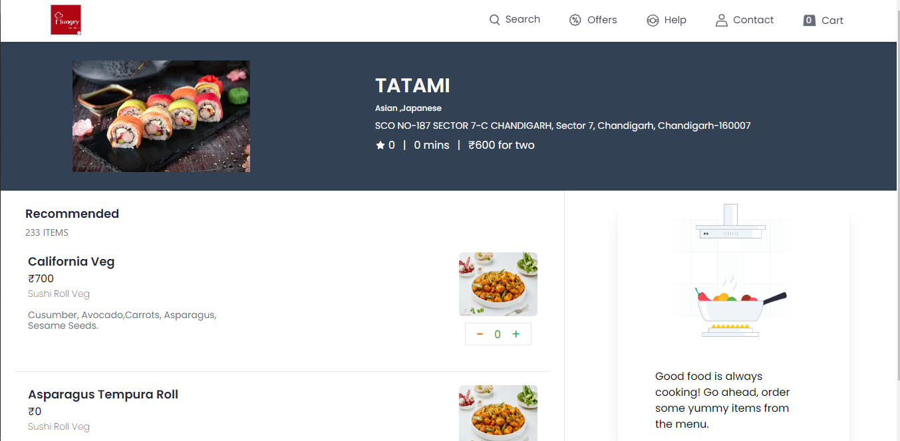

# Food App

Food Ordering Frontend App

## Tech Stack

### Frontend

&nbsp;
&nbsp;
&nbsp;
&nbsp;

### Server
 Used Swiggy's API's to fetch restaurants and food items.

## Features

- Cart Add/Remove Items 
- Restaurants Search
- Filters Based on Category/Ratings | Price Range
- Implemented shimmer UI

## Sneak Peek of Food App
<table>
  <tr>
    <td></td>
    <td></td>
  </tr>
  <tr>
    <td></td>
  </tr>
</table>

## Contact
If you want to contact me, you can reach me through below handles.

